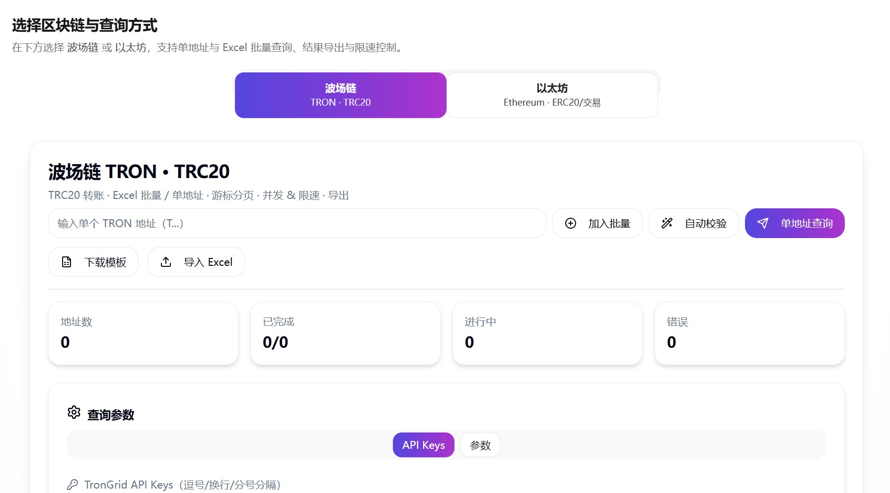

# 链上取证 · Multi-chain · 多链地址批量查询与导出助手 ⚡️

[](https://github.com/Eysn0130/multichain-exporter/actions)
[](https://Eysn0130.github.io/multichain-exporter/)


> 在浏览器中一站式批量查询 **以太坊 Ethereum（外部交易 / 内部交易 / ERC-20）** 与 **波场 TRON（TRC-20）** 的地址历史，并支持 Excel/CSV 导出。纯前端、无后端、开箱即用。🚀

**在线体验**：<https://Eysn0130.github.io/multichain-exporter/>

---

## ✨ 特性

- 🧭 **多链支持**：Ethereum（Transactions / Internal / ERC-20）、TRON（TRC-20）
- 📥 **Excel 导入模板**：一键导入地址列表，自动去重
- 🔍 **单地址 / 批量查询**：UI 简洁直观，进度与统计实时更新
- ✅ **地址格式校验 & 智能候选**
  - 单地址输入与列表行均支持「自动校验」候选生成
  - 当地址本身正确时：**按钮本体变为「地址正确」(绿色) 并禁用 2 秒**，随后自动还原（不再额外弹窗 / Badge）
  - 输入框右侧：**即时校验图标（✔/✖，250ms 防抖）**
- 🚦 **并发与限速可配**：并发数、QPS 上限、分页间隔、超时，内置退避与重试
- 📤 **导出**：支持 Excel（.xlsx）与 CSV
- 🧩 **过滤器**：ETH ERC-20 支持合约地址过滤
- 🧰 **技术栈**：Vite 7 · React 19 · TypeScript 5 · shadcn/ui · Radix UI · TailwindCSS

---

## 🖼️ 界面预览

> 将你的截图放到 `docs/` 并在此处引用：
>
> 

---

## 🏁 快速开始（本地开发）

> 需要 **Node.js ≥ 20** 与 **npm**。

```bash
git clone https://github.com/Eysn0130/multichain-exporter.git
cd multichain-exporter
npm i
npm run dev
